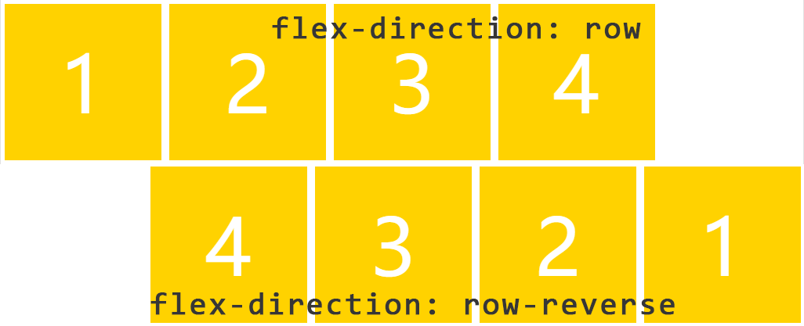
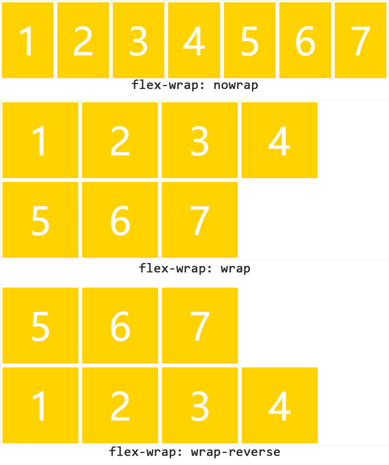
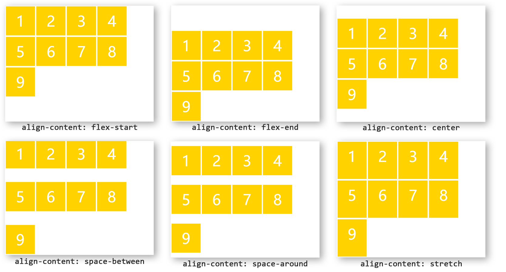
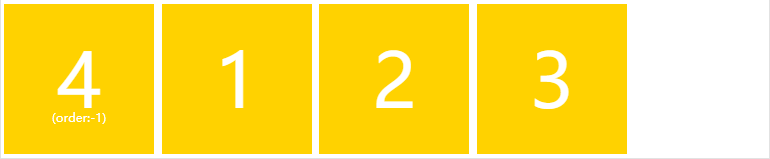
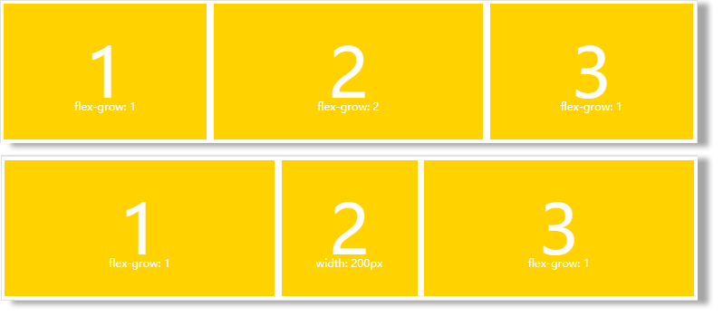

## **2021年5月24日前端面试**

------
[TOC]
-----
## 1.HTML面试题

### **# meta viewport 是做什么用的，怎么写？**

​	控制页面在移动端不要缩小显示

```
<meta name="viewport" content="width=device-width, user-scalable=no, initial-scale=1.0, maximum-scale=1.0, minimum-scale=1.0">
```

## 2.CSS面试题

### **# flex弹性盒子布局**

#### 	什么是 flex 布局

​	Flex 是 Flexible Box 的缩写，意为"灵活的盒子"或"弹性的盒子"，所以 flex 布局一般也叫作"弹性布局"

#### 	基本概念
##### 		什么是 flex 容器（flex container）？

​	采用 flex 布局的元素，称为 flex 容器：	

```css
.box { 
    display: flex | inline-flex; 
}
```

##### 		什么是 flex 项目（flex item）？

​	flex 容器的所有子元素自动成为容器成员，称为 flex 项目【项目默认沿主轴排列】


#### 	容器的属性
##### 		display 属性

​	display 属性决定是否使用flex布局：

```css
.box { 
    display: flex | inline-flex; 
}
/* flex：将对象作为弹性伸缩盒显示 */
/* inline-flex：将对象作为内联块级弹性伸缩盒显示 */
```

##### 		flex-direction 属性

​	flex-direction 属性决定主轴的方向（即项目的排列方向）：

```css
.box { 
    flex-direction: row | row-reverse | column | column-reverse; 
}
/* row（默认值）：主轴为水平方向，起点在左端 */
/* row-reverse：主轴为水平方向，起点在右端 */
/* column：主轴为垂直方向，起点在上沿 */
/* column-reverse：主轴为垂直方向，起点在下沿 */
```


##### 		flex-wrap 属性

​	默认情况下，项目都排在一条线（又称”轴线”）上。flex-wrap属性定义，如果一条轴线排不下，如何换行

```css
.box{ 
    flex-wrap: nowrap | wrap | wrap-reverse; 
}
/* nowrap（默认）：不换行 */
/* wrap：换行，第一行在上方 */
/* wrap-reverse：换行，第一行在下方 */
```


##### 		flex-flow

​	flex-flow 属性是 flex-direction 属性和 flex-wrap 属性的**简写形式**，默认值为 row nowrap

```css
.box { 
    flex-flow: <flex-direction> || <flex-wrap>; 
}
```

##### 		justify-content 属性

​	justify-content 属性定义了项目在**主轴上的对齐方式【横】**

```css
.box { 
    justify-content: flex-start | flex-end | center | space-between | space-around; 
}
/* flex-start（默认值）：左对齐 */
/* flex-end：右对齐 */
/* center： 居中 */
/* space-between：两端对齐，项目之间的间隔都相等 */
/* space-around：每个项目两侧的间隔相等。所以，项目之间的间隔比项目与边框的间隔大一倍 */
```

##### 		align-items 属性

​	align-items 属性定义项目在**交叉轴上如何对齐【竖】**

```css
.box { 
    align-items: flex-start | flex-end | center | baseline | stretch; 
}
/* flex-start：交叉轴的起点对齐 */
/* flex-end：交叉轴的终点对齐 */
/* center：交叉轴的中点对齐 */
/* baseline: 项目的第一行文字的基线对齐 */
/* stretch（默认值）：如果项目未设置高度或设为auto，将占满整个容器的高度 */
```

##### 		align-content 属性

​	align-content 属性定义了多根轴线（多行）在交叉轴上的对齐方式，**如果项目只有一根轴线（一行），该属性不起作用**

```css
.box { 
    align-content: flex-start | flex-end | center | space-between | space-around | stretch; 
}
/* flex-start：交叉轴的起点对齐 */
/* flex-end：与交叉轴的终点对齐 */
/* center：与交叉轴的中点对齐 */
/* space-between：与交叉轴两端对齐，轴线之间的间隔平均分布 */
/* space-around：每根轴线两侧的间隔都相等，所以，轴线之间的间隔比轴线与边框的间隔大一倍 */
/* stretch（默认值）：轴线占满整个交叉轴 */
```


#### 	项目的属性
##### 		order 属性

​	order 属性定义项目的排列顺序

```css
.item { 
    order: <integer>; 
}
/* 数值越小，排列越靠前，默认为0 */
```



##### 		flex-grow 属性

​	flex-grow 属性定义项目的放大比例

```css
.item { 
    flex-grow: <number>; /* default 0 */ 
}
/* 默认为0，即如果存在剩余空间，也不放大 */
/* 如果所有项目的 flex-grow 属性都为1，则它们将等分剩余空间（如果有的话） */
/* 如果一个项目的 flex-grow 属性为2，其他项目都为1，则前者占据的剩余空间将比其他项多一倍 */
/* 如果有的项目有 flex-grow 属性，有的项目有 width 属性， 有 flex-grow 属性的项目将等分剩余空间*/
```



##### 		flex-shrink 属性

​	flex-shrink 属性定义了项目的缩小比例

```css
.item { 
    flex-shrink: <number>; /* default 1 */ 
}
/* 默认为1，即如果空间不足，该项目将缩小 */
/* 如果所有项目的 flex-shrink 属性都为1，当空间不足时，都将等比例缩小 */
/* 如果一个项目的 flex-shrink 属性为0，其他项目都为1，则空间不足时，前者不缩小 */
/* 负值对该属性无效 */
```

##### 		flex-basis 属性

​	flex-basis 属性定义了在分配多余空间之前，项目占据的主轴空间（main size）
​	浏览器根据这个属性，计算主轴是否有多余空间
​	它的默认值为auto，即项目的本来大小

```css
.item { 
    flex-basis: <length>; | auto; /* default auto */ 
}
```

##### 		flex 属性

​	flex 属性是 flex-grow, flex-shrink 和 flex-basis 的简写

```css
.item { 
    flex: none | [ <flex-grow> <flex-shrink>? || <flex-basis> ] 
}
/* 默认值为0 1 auto */
/* 后两个属性可选 */
/* 该属性有两个快捷值：auto (1 1 auto) 和 none (0 0 auto) */
```

##### 		align-self 属性

​	align-self 属性允许单个项目有与其他项目不一样的对齐方式，可覆盖align-items属性

```css
.item { 
    align-self: auto | flex-start | flex-end | center | baseline | stretch; 
}
/* 默认值为auto，表示继承父元素的align-items属性*/
/* 如果没有父元素，则等同于stretch */
```

## 3.JS面试题

### **# var与let、const的区别**

#### **var声明变量存在变量提升，let和const不存在变量提升**

```javascript
console.log(a); // undefined  ===>  a已声明还没赋值，默认得到undefined值
var a = 100;
console.log(b); // 报错：b is not defined  ===> 找不到b这个变量
let b = 10;
console.log(c); // 报错：c is not defined  ===> 找不到c这个变量
const c = 10;
// 再来看这段代码
function fn() {
   //var a
    if (true) {
        console.log(a + ' now')
    }
    else {
        var a = 1
        console.log(2)
    }
}

fn() // a -> undefined
// 我们发现不执行的代码也会影响会执行的代码，因为var a会提升到if语句的前面

/* undefined可以翻译为不明确，not defined可以翻译为未定义 */
```

#### **let、const都是块级局部变量**

​	顾名思义，就是只在当前代码块起作用

```javascript
{
    let a = 1
}
console.log(a) // undefined

// const 的特性和 let 完全一样，不同的只是
// 1）声明时候必须赋值
// 2）只能进行一次赋值，即声明后不能再修改
// 3）如果声明的是复合类型数据，可以修改其属性
```

#### **同一作用域下let和const不能声明同名变量，而var可以**

```javascript
const a =2
const a=1

// 编译器报错：SyntaxError: Identifier 'b' has already been declared
```

## 4.VUE面试题

### # computed 和 watch 的区别和运用的场景？

**computed**： 是计算属性，依赖其它属性值，并且 computed 的值有缓存，只有它依赖 的属性值发生改变，下一次获取 computed 的值时才会重新计算 computed 的值；

**watch**： 更多的是「观察」的作用，类似于某些数据的监听回调 ，每当监听的数据变化时 都会执行回调进行后续操作；

**运用场景：**

- 当我们需要进行数值计算，并且依赖于其它数据时，应该使用 computed

  因为可 以利用 computed 的缓存特性，避免每次获取值时，都要重新计算

- 当我们需要在数据变化时执行异步或开销较大的操作时，应该使用 watch

  使 用 watch 选项允许我们执行异步操作 ( 访问一个 API )，限制我们执行该操作的频率

  并在我们得到最终结果前，设置中间状态。这些都是计算属性无法做到的。